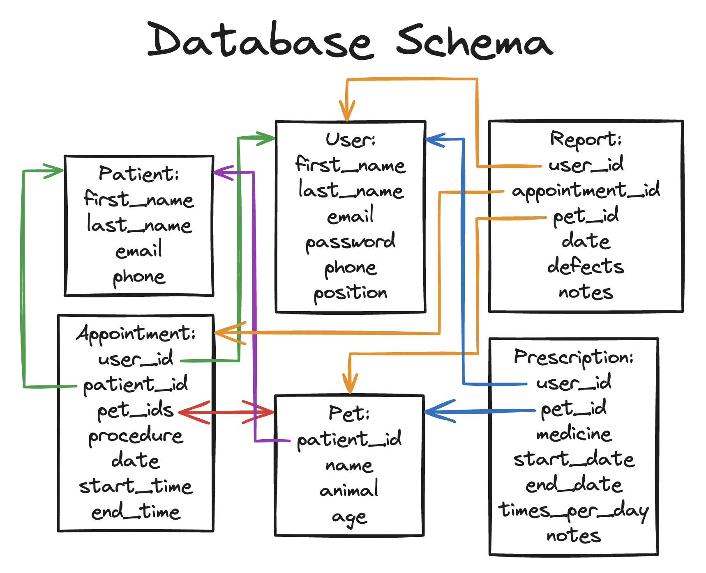

# About

Welcome to Vet Management! After diving into the essentials of Rails — including MVC architecture, routing, Active Record, Action View, Action Controller, and the Rails console — I'm now applying these skills to a new project: a veterinary management web app system. This venture will not only utilise my foundational Rails knowledge but also lead me to explore advanced features such as complex associations, implementing and managing user roles and permissions, and more. I've intentionally designed this app with a vast array of features and routes to maximise my learning through hands-on practice and the repetition of core Rails development tasks. Below is the schema I've crafted for this project.

    

